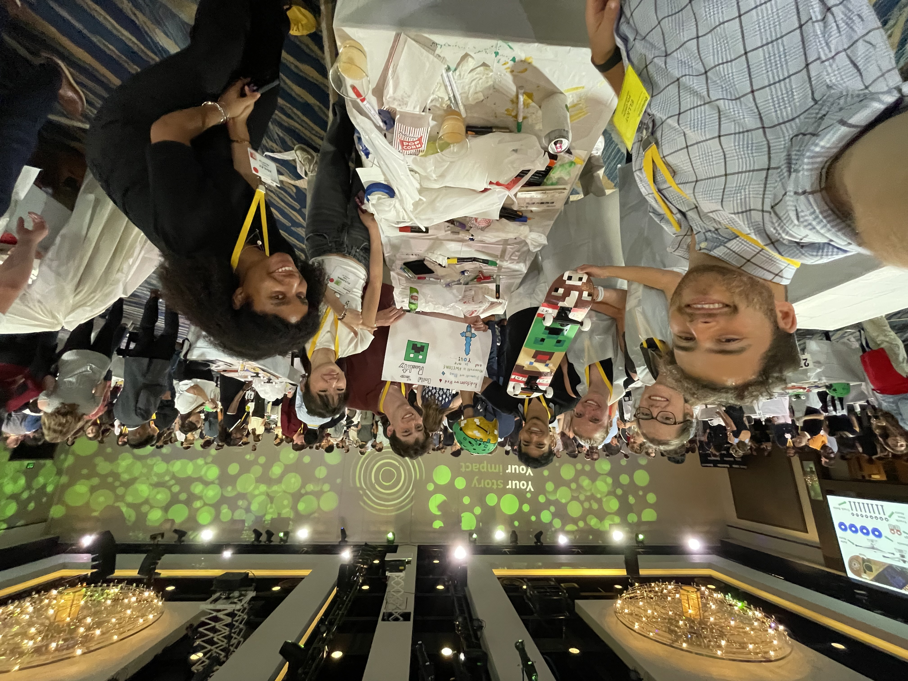

# Kate Edwards

<!--
**Kate-Edwards3802/Kate-Edwards3802** is a ✨ _special_ ✨ repository because its `README.md` (this file) appears on your GitHub profile.
-->

**Distinction Portfolio at the University of Denver - Daniels Business College
 Major: Business Information and Analytics
 Minor: Computer Science**

## Resume, LinkedIn, Email
[My Resume](9_24_Resume.pdf)
 https://www.linkedin.com/in/kate-edwards-du/
 katieedwards2828@gmail.com

-----
<!-- Navigation buttons -->

  
  
  
  
  

## Communication and Interpersonal Effectiveness
**Case Competitions**
 Over my time at DU I participated in 3 group case competitions. My presentation skills grew immensely over this time. While crafting a solution to the problem was important it was also important to clearly, concisely, and persuasively present the solution. You had to clearly coordinate and communicate with your team members to ensure that their sections flowed smoothly into yours. I learned small things like highlighting the sections of a graph you are trying to draw attention to. I learned better passoffs between team members during presentations. Most importantly, I learned how to practice a presentation until I had the right points memorized without memorizing a script. This enabled me to say everything I wanted while avoiding the pitfalls that come from memorizing a speech. While public speaking has always made me nervous, I feel much more confident after participating in these case competitions. The competitions increased the pressure because I knew there was money at stake and my teammates were relying on me. I learned to manage stress and to successfully present, despite the additional nerves the setting brought up. Competing in these settings has taught me to overcome my nervousness so I can present effectively.
|  |  |
|:------------------------------------------:|:---------------------------------------:|
| Presenting my slides during a case competition      | Celebrating our success at another case competition |

**Lifeguarding**
 Throughout parts of high school and college, I worked in various lifeguarding roles. I started by lifeguarding at the public pool and was later asked if I would get a separate open water certification so I could become a lifeguard at Durango's local lake. While working as a lifeguard, it became quickly evident that everyone needed to work as a team. We would often have zones that would overlap and needed to communicate who would handle any arising issues. When there was an emergency situation, we would need to quickly and clearly communicate everyone's role so that everything was covered. When I transitioned to open water lifeguarding, I was sometimes on a floating obstacle course 100 meters from land. I could only communicate with other guards through the radio. This posed challenges as we were unable to read each other’s nonverbal cues and couldn’t tell who had received our message. If communication wasn’t clear, the system could fall apart. Lifeguarding was my introduction to working as part of a team and communication within that team was critical to properly responding to high-stress situations. 
As a lifeguard, I also worked with a co-instructor to teach children how to swim. I taught everything from basic swimming skills to diving. Having been a competitive swimmer since middle school, it took skill to explain concepts that were second nature to me in a way that the kids could understand. I formed relationships and built trust with the kids I taught, which was important to me. This trust helped earn me their respect. It was rewarding to see their skills grow and their character mature.

**Internship at Deloitte**
 My internship this summer exposed me to typical workplace forms of communication. I sat in on small group planning meetings and saw how problems were approached. I initiated agendas for these meetings to ensure nothing was forgotten. One of the things that struck me most about these meetings was how the first 5 minutes would typically be devoted to casual conversation so that you truly felt like you were friends with your coworkers. This meant that disagreements were easier to resolve and no one was afraid to bring up ideas or make mistakes in front of the team. I also attended and put together the slide deck for a 250+ person all-hands meeting. While I was leading the icebreaker for this meeting, we weren’t getting many responses so I chose to ask a few specific colleagues about how the icebreaker applied in their part of the globe which sparked an interesting discussion. I also had many email chains with senior leadership because I was trying to collect information for a central proposal repository. From all of these email chains I learned how to match other people’s email styles. I also worked on being more concise in my emails. My communication grew from this experience. I learned to overcommunicate rather than undercommunicate. It was helpful for me to give regular, unprompted updates on my progress to leadership. By having open, honest, and regular communication, my colleagues were able to trust me.
|  |  |
|:------------------------------------------:|:---------------------------------------:|
| I had the incredible opportunity to go to Deloitte University (also known as DU) during my internship      | During my time at Deloitte University, we painted skateboards to encourage increased attendance at a local school |

-----
## Community Engagement and Leadership
**Stepping in when needed**
 I believe one of the most important forms of leadership is being able to recognize when a leader is needed and rising to fill that occasion. During my Freshman year of college, my roommate told me she had taken too many prescription pills. I immediately suggested we go to the ER, which she refused. As she was completely coherent and was refusing to get help, I started asking questions to get a better understanding of the urgency of the situation. I asked her what she took, how much, and when. After assessing that it wasn't a life-threatening but was still quite serious, I chose to get in touch with one of her close friends who lived in our building to see if she could convince her to go to the ER. Together, we were able to convince her that she needed to go to the ER. While this likely wasn’t the perfect reaction to the problem, I’m proud that I was able to react with calm composure to a situation I had never faced and never thought I would have to face. Sometimes you are forced into leadership in a situation that you are unprepared for and unfamiliar with. It’s important to be able to maintain a level head, know when you need help, and react with compassion. I’m glad my roommate was able to get the help she needed and that I was able to facilitate that for her. Leadership doesn't have to be a structured role. Being a person others in your community feel they can turn to in a crisis is one of the most powerful forms of leadership. 

**Code advantage job**
 I had the opportunity to teach some incredible kids basic coding concepts. I acted as an instructor with another co-instructor for a class of up to 20 K-2 kids at a local charter school. As I got to know these kids, I was quickly impressed by their perseverance, resilience, and curiosity. While I found it important to teach them basic coding skills, it became evident that, more than anything, they needed a steady and positive influence in their life. They would tell me unprompted stories about messy divorce cases their parents were going through or trouble they were having with other kids in school. They trusted me to listen to them and to help as best as I could. Being someone who is open and honest as well as consistently available and sympathetic, made me a good leader in their eyes. When they got into disputes in class, they would trust me enough to tell me what it was really about. They would proudly show me what they had learned in class that day. Every day, when I would show up, some of them would come up and hug my legs. Being able to make a positive impact as a leader can present you with tough situations, but it can also be deeply rewarding. Being able to make a positive impact on those kids' lives was valuable to me as well as them. I found that it’s important as a leader to be someone that people feel they can approach and tell the truth to.

**PLP**
 During my time at DU, I was also able to live with the Pioneer Leadership Community as well as take classes through the program. My favorite lesson from this time was that it’s important to make sure you understand other people’s definitions. Lots of disagreements are actually misunderstandings. Two people can agree on a concept but think they disagree because they are talking about two different things. People have different definitions because they come from different background and it's important to check in about those definitions. While I learned a lot in the PLP program and met people I’m still friendly with, I didn’t feel the program suited my style of quieter leadership, so I left at the end of my Freshman year. Despite this, I learned a lot of lessons in my time at the program from how to break tough news to how to avoid misunderstandings. It was useful to get formal teaching in leadership.

-----
## Global/Intercultural Competence
**Growing up in a small mountain town**
 Coming from a small mountain town, I found a different type of diversity at DU than I’d ever experienced before. Growing up in Durango, there were surprising areas of diversity. I had a Mormon piano teacher. There was an Amish community on the outskirts of our town. We also had a Catholic K-8 school. I got to know many people of different religious backgrounds. Going to public school in Durango also forced you to become familiar with people who had backgrounds different from your own. In class, there would be people from the town and people from the rural surrounding areas. In one of my classes, one of my peers missed a test because she was helping her goat give birth. We would have lots of different political views, religious views, and geographical backgrounds all in one classroom. Everyone had to get along though, because the classes were so small. One of my peers' mother was my haircutter, another peer's mother taught me to ride horses, and yet another peer’s mom was my mom’s doctor. Because everyone knew each other, we all got along fairly well despite our differences. I believe that growing up in this type of setting set me up to further embrace diversity in my college experience. From a young age, I learned that different backgrounds and experiences could influence us to have different viewpoints. These views almost always had logic behind them if people sat down and had a discussion. These different viewpoints were a strength because other people would bring up points we hadn’t even considered but were obvious to them given their background. 

**Expanding my experience with diversity in college**
 While the small town I grew up in had lots of diversity, in some ways it also lacked diversity. I was exposed to very little racial diversity growing up and most people I met were born in the US. When I moved to Denver I became friends with someone whose parents had immigrated from India after an arranged marriage. While this background was very different from mine, I was honored to be welcomed by her family. Her mother took the time to teach me and some of our other friends how to cook Indian dishes. She even gifted us with some spices from her cabinet. When Ramadan came around, one of their family friends gave us Henna. Having her family be so kind and welcoming had a big impact on me. I was able to discuss with her parts of her background and what she agreed with and didn’t agree with, which was deeply insightful for me. Being welcomed by my friends into their cultures helped me understand them better and also understand my view of the world better. Seeing the way others live their life and their values can help guide your own.
|  |
|:------------------------------------------:|
| My friends and I learned how to cook traditional Indian dishes. Being welcomed into different communities was very moving     |

**Study abroad experience at Oxford**
 Between my Sophomore and Junior year, I chose to spend the summer studying abroad at Oxford. Coming from a town where the nearest city with over 50,000 people was 3.5 hours away, and in a different state, was very different from studying abroad. Landing in London, a city with 9 million people, was intimidating to say the least. On top of that I needed to use public transportation to reach Oxford. Public transport was virtually nonexistent in my hometown, so I needed to learn quickly. Over time I became proficient enough at using public transportation that I used it to travel to Paris a week before the 2024 Olympics. I was able to adapt to the large cities that were so different from my home. While I believe adaptation to other cultures is important for keeping an open mind, one of the most interesting things about my time at Oxford was the teaching style.
The Oxford style of teaching is centered around small dialogue focused classrooms. My class was my Oxford professor, two other students, and me. We would come to class having read the necessary material and then we would spend class discussing. I learned that the Oxford method of teaching had been around for centuries. Getting to experience this different format of teaching had its benefits and drawbacks. At Oxford, I learned a lot about the history of Great Britain and France, which I was able to weave into the history that the US is based. Being able to see how their culture had influenced the US and where we had strayed from their government and legal systems deepened my understanding of the US.
|  |  |
|:------------------------------------------:|:---------------------------------------:|
| The view of Magdalen Tower from my dorm. The architecture was quite different at Oxford      | We traveled across Wales for hands on learning as part of the program |
|  |  |
| I travelled to Paris via public transport, which involved stepping outside of my comfort zone      | Inside Duke Humfrey's Library in the Bodelian where I would study sometimes |

**Summer experience at Deloitte**
 I was able to apply my previous experiences in a work setting during my 2025 summer internship at Deloitte. I was privileged to work on a very global team. While this presented the typical workplace challenges of different time zones, it also sparked additional learning. My colleagues and I were able to connect and learn about each other during work. I learned that people in Bern Switzerland will sometimes float home down the river from work as a means of transportation. Our moments of connection required grace on both of our parts. Instead of a spelling error in an email meaning someone didn’t take the time to double check their email, it was often due to a language barrier. Sometimes emails were forwarded to me in another language, but my colleague would typically include a short summary of the important points in English at the top. Working together required thinking ahead about other’s primary languages and time zones as well as offering each other grace. It also allowed us to bring more opinions to the table, which was helpful in making the best decisions.

-----
## Ethical Decision Making
**Biomedical ethics class**
 Some people think Ethics is a clear cut subject. They think that people intuitively know the difference between right and wrong. My biomedical ethics class quickly proved that concept wrong. We tackled many different topics using emotional and logic arguments to see both sides of various issues. We tackled problems from the trolley problem (and its many different iterations) to whether there is an ethical difference between Physician-Assisted Suicide and Death with Dignity. When it comes to ethics, biomedical ethics is often one of the most divisive and emotionally fraught sectors as it has life and death implications. It can get personal quickly. This was a class I found myself thinking about often outside of class. I enjoyed how it could be hard to tell what the right decision was. Our ethics are a core part of who we are, so it’s especially hard and thought provoking when we are presented with an ethical question that isn’t immediately clear. I found it fascinating to hear everyone’s different perspectives and ways of thinking on a problem. This class was a fabulous introduction to the ethics at DU.

**Ethics bootcamp**
 The Ethics Bootcamp is typically a mandatory part of DU's Foundations of Business Law and Ethics class. While I had dual enrollment credit for this class, I still attended the Ethics bootcamp. In this experience, I heard many of DU’s law professors speak on ethical dilemmas. They discussed how abandoning your ethics in a professional setting could land you in jail, how “just this once” seldom remains at just that once, and how our ethics are critical to who we are as a person. Professor Ciocchetti of the Business Ethics and Legal Studies department gave a speech on why ethics matters that I found particularly impactful. He talked about why we should do the right thing even when no one is looking. One of his most insightful stories was about putting away shopping carts. No one is ever rewarded for putting away their shopping cart. When someone puts away their shopping cart, it’s purely because it's the right thing to do. I think this notion is especially interesting because during my travels to other countries, there were some places where they had put in place systems that ensured the return of shopping carts. The implementation of this incentive system clearly indicates that not everyone does the right thing for the sake of it. However, the parking lots here aren't littered with unreturned shopping carts so most people do the right thing. I found Dr. Ciocchetti’s speech really impactful because it gave a great example of people doing the right thing when there is no clear gain to us. It’s important to me to contribute to the world by being someone who does the right thing because it's right.

-----
## Technical Knowledge and Critical Thinking
**Research class**
During my time at DU, I participated in an invite-only research class. To get into this class, you had to be recommended by a professor. This ended up being one of my favorite classes at DU. In the 10 week quarter, myself and two other students came up with a research question and attempted to write a research paper. In writing this, we found out that the data we needed didn't exist, but it was still a useful experience. The paper was focused on the question: Is there a connection between the rise in online interest and the frequency of outdoor-related injuries? 
This paper required extensive research into previous papers written on similar subjects so that we could ensure our question was unique. It also required lots of revisions and iterations. The process helped me learn how to write and read research. In this class, I also contributed to weekly research paper discussions. These discussions often brought up interesting debates that I valued. Reading different weekly research papers introduced me to a myriad of different resources within the Business Analytics sphere.

**Experiences with AI**
As a Freshman, I had never heard of AI. By the time my Junior year ended, AI had transformed education. Throughout my experience in college, I found that AI can be incredibly helpful but also quite destructive. I’ve seen classmates paste an assignment description into AI and get the entire answer out. This skips all learning. The way I chose to use AI was as an on demand TA. If I had a question about a topic, I could ask AI. If I was still confused, I could ask for a different style of explanation or for examples. It was also very helpful when I went over tests. I would go through the questions I got wrong and ask AI why my answer was incorrect. Most of the time, AI is great at both of these tasks. The problem with AI is that it sometimes gets things wrong. I needed to verify its information. 
AI can also come up with solutions you didn’t know existed. For my nonparametric statistics class, I had to turn data on a website into an Excel spreadsheet so I could easily analyze it. I asked AI what my options were besides copying each row of data into an Excel file by hand. It informed me that Python was capable of generating an Excel spreadsheet, which I didn’t know. This allowed me to create a Python script, which split the text based on tabs and gave me an Excel sheet as an output. This saved me countless hours of repetitive work. When AI is used as a tool to easily explain a concept or help you grasp something, it can be useful. It’s also helpful when it shows you tools you didn’t know about. 
AI is common throughout the work world and professionals need to know how to use it. Learning what it is good at as well as how to get useful outputs is a skill that's required in the workplace. It's also important to know how to quickly fact check AI. It can be powerful as long as you don’t use it in a way that cuts out all learning.

**Internship at Deloitte**
My time at Deloitte let me see how problems were tackled in a real world situation. The team I was on would be given a problem which would then be broken up into smaller problems that were all related. We would have lots of meetings throughout the process to make sure that everyone was on track and that all of the parts of the project were aligning correctly with each other. This took a lot of trust between team members. The lack of hard deadlines was also interesting. Over my time there, I gained the trust of my team and even received praise from senior leadership. One of the reasons I was able to gain this trust was that I checked all of my available resources for an answer before asking a teammate a question. Taking initiative was important in the work world. I really valued this opportunity to gain insight into the corporate world.

-----
## Other ways I spent my time during college
|  |  |
|:------------------------------------------:|:---------------------------------------:|
| I got to experience Denver classics like seeing a concert at Red Rocks      | I hiked my first 14er, Quandary Peak |
|  |  |
| One of my favorite activities was to go skiing with friends      | I managed my fear of heights to go ice climbing |
|  |  |
| I spent lots of time outdoors, including organizing a camping trip with friends      | My friends and I explored Great Sand Dunes National Park |
|  |  |
| My favorite sport became climbing      | I got to explore Rocky Mountain National Park with friends and went on classic hikes like Chasm Lake and Sky Pond |

